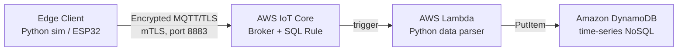

# Edge-to-Cloud Automated IoT Telemetry Pipeline

A simulated industrial/medical IoT monitoring pipeline: a resource-constrained edge
device securely streams telemetry over MQTT/TLS to AWS IoT Core, which triggers a
serverless ingestion pipeline that validates and persists the data. The entire cloud
infrastructure is also fully reproducible via Terraform (Infrastructure as Code).

## Architecture



**Security model:** the edge client authenticates using mutual TLS. It presents an
X.509 device certificate and private key issued by AWS IoT Core, and validates AWS's
server certificate against the Amazon Root CA. An IoT policy scopes exactly what the
device is allowed to do (`iot:Connect`, `iot:Publish` on a single topic).

## What's in this repo

| Path | Purpose |
|---|---|
| `edge_telemetry_simulator.py` | Simulated edge device. Generates realistic drifting sensor readings (temperature, humidity, voltage) and publishes them over MQTT/TLS. |
| `terraform-iot/main.tf` | Infrastructure as Code. Provisions the DynamoDB table, IAM role (least-privilege, scoped to one table), Lambda function, and IoT topic rule in one `terraform apply`. |
| `terraform-iot/lambda/lambda_function.py` | Lambda source deployed by Terraform. Parses incoming telemetry JSON and writes it to DynamoDB. |
| `.gitignore` | Excludes certificates, private keys, and Terraform state from version control (see Security note below). |

> **Note:** the manually-created Lambda source (used during initial console-based
> setup, before the Terraform version existed) is functionally identical to
> `terraform-iot/lambda/lambda_function.py` and is omitted here to avoid duplication.

## Setup

### 1. Prerequisites
- Python 3.10+
- `pip install paho-mqtt`
- An AWS account with IoT Core, Lambda, and DynamoDB access
- [Terraform](https://developer.hashicorp.com/terraform/install) + [AWS CLI](https://aws.amazon.com/cli/) (for the IaC path)

### 2. Provision the cloud infrastructure
```bash
cd terraform-iot
terraform init
terraform plan
terraform apply
```
This creates the DynamoDB table, IAM role/policy, Lambda function, and IoT rule.

### 3. Register the edge device
In AWS IoT Core, create a Thing, generate a device certificate + private key, download
the Amazon Root CA, and attach an IoT policy permitting `iot:Connect` / `iot:Publish`.
Place the three files locally (**never commit these**):
```
certs/
├── AmazonRootCA1.pem
├── device-certificate.pem.crt
└── private.pem.key
```

### 4. Run the edge simulator
Update `AWS_IOT_ENDPOINT` and `TOPIC` in `edge_telemetry_simulator.py` to match your
account (endpoint found under IoT Core → Settings, or Connect → Domain configurations),
then:
```bash
python edge_telemetry_simulator.py
```
Telemetry should begin appearing in the DynamoDB table within seconds.

## Security notes

- **Certificates and private keys are excluded via `.gitignore`.** A leaked private
  key lets anyone impersonate your device and publish arbitrary data (or, depending on
  the attached policy, take other actions in your AWS account). Rotate/deactivate any
  certificate that has ever been committed to a public repo.
- **Terraform state files are excluded** since they can contain resource metadata and,
  depending on configuration, sensitive values.
- The Lambda's IAM role in the Terraform version is scoped to `dynamodb:PutItem` on a
  single table ARN, not the broader `AmazonDynamoDBFullAccess` managed policy used in
  the initial manual setup.

## Tech stack

Python · AWS IoT Core · AWS Lambda · Amazon DynamoDB · MQTT/TLS (mTLS) · Terraform
